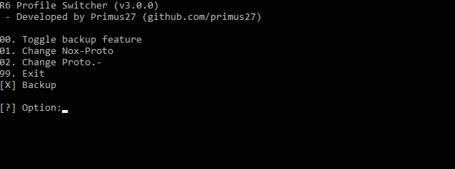
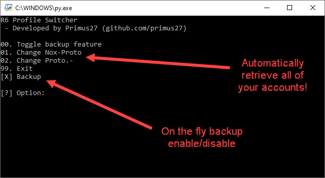
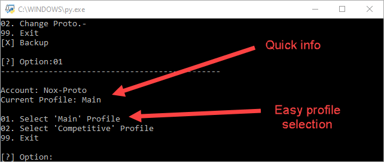
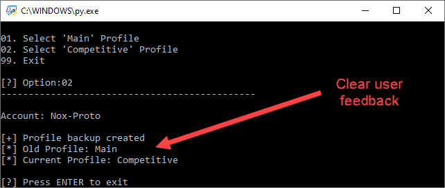

&nbsp;

No more swapping files whenever you want to scrim, the R6 Profile Switcher does everything for you. You can easily switch between your competitive profile (with default skins) and your skins that you use in ranked (i.e. Elites, Ember Rise skins...).

# Features
 - Easily switch between profiles by navigating the intuitive menus.
 - Automatically retrieves account names on your PC so you don't have to do any work figuring out which account ID is the right one.
 - On the fly profile backup w/ timestamps
 - Backup failsafes to prevent anything from going wrong if a backup cannot be made
 - Full user feedback about what profile is active.
 - No coding knowledge required.

## Demo

> Demo

# Requirements and Installation
 1) Download and install [Python 3](https://www.python.org/)
    1) Navigate to [Python 3](https://www.python.org/downloads/windows/) install page
    2) Click on '_Latest Python 3 Release - Python 3.X.X_' near top of page
    3) Scroll down to '_Files_' and download either:
        1) '_Windows x86-64 embedded zip file_' or
        2) '_Windows x86-64 executable installer_'
        
        
    4) Install Python 3
        1) Make sure that:
            - '_Install launcher for all users_' = **checked**
            - '_Add Python 3.8 to PATH_' = **checked**
            
            
        2) Click on '_Disable path length limit_' (requires admin privileges)
        
            
 
 2) Download `switch_v3.py` and `requirements.txt` (Download the repository as zip and extract)
 
 3) Install dependencies (found in requirements.txt)
    1) Press `Win`+`S`
    
    2) Type `file explorer`
    
    3) Using the file exporer, navigate to your (downloads) directory where `requirements.txt` is
    
    4) In the file exporer address bar type `cmd` and press `ENTER`
    
    
    &nbsp;
    
    5) Using command prompt (cmd) type `pip3 install -r requirements.txt`. If that doesn't work, type `py -3 -m pip install -r requirements.txt`
    
    
 4) Disable cloud backup in Uplay: Uplay launcher -> settings -> general -> disable "Enable cloud save synchronisation for supported games". 
	- This is so that it doesn't keep restoring the profile stored in the cloud.
	

# Usage
 - Run 'switch_v3.py' by double clicking on the file

# Changelog
### Version 1.0.0 - Initial release
 - Internal (not available)
 
### Version 2.0.0 - Github release
 - Easily switch from your main profile (containing all skins and attachments) to your competitive profile (containing legal skins).
 - Automatically create backups of profile w/ timestamps
 
### Version 3.0.0 - Program rework (menus, player name resolver...)
 - Added menu
 - Added on the fly backup enable / disable
 - Added player ID to player name resolver - no more copy/pasting paths
 - Added 'active profile' feedback before profile selection
 
# Screenshots

> Main menu

> Profile selection

> Summary info

&nbsp;

# Legacy (v2.0.0)

NOTE: switch.py v2.0.0 is legacy software and should only be used if you encounter issues with v3.0.0.
The newer version is however backwards compatible with the old version and vice versa.
This means your profiles will still work regardless of which version are using.

### Screenshots

> Application demo

### Requirements and Installation
 1) Download and install [Python 3](https://www.python.org/)
 2) Download `switch_v2.py` (Download the repository as zip and extract)
 3) Disable cloud backup in Uplay: Uplay launcher -> settings -> disable "Enable cloud save synchronisation for supported games". 
	- This is so that it doesn't keep restoring the profile stored in the cloud.
 4) Navigate to your R6 profile directory:
    - C:\Program Files (x86)\Ubisoft\Ubisoft Game Launcher\savegames\\{profile}\635
 5) Copy this path to `switch.py` at ~line 21
    - This also can be found under `# Define profile path` ~line 20
    - You can do do this by right clicking on the `.py` file and selecting `open with notepad` or `open with notepad++`
    
    
    
 6) If you do not want to make backups, set the backup flag to 'False' at ~line 17 
    - This also can be found under `# Enable backup of current profile before switching profile` ~line 16
    - You can do do this by right clicking on the `.py` file and selecting `open with notepad` or `open with notepad++`
    
    

### Multiple Siege Accounts

#### Method 1
If you have multiple accounts and aren't sure about which account is the right one, open up: **"C:\Users\\{name}\Documents\My Games\Rainbow Six - Siege\\{any profile}\GameSettings.ini"** and change **AimDownSightsMouse** ~line 109 to any number. Load up the game and see whether that account's ADS was affected. Keep trying until you find the right account.

#### Method 2
Visit [R6Tab](https://tabstats.com/siege) and enter your playername.
Afterwards, check the URL and your account ID will be seen at this part of the URL:
https://tabstats.com/siege/player/{name}/{**account_ID**}

