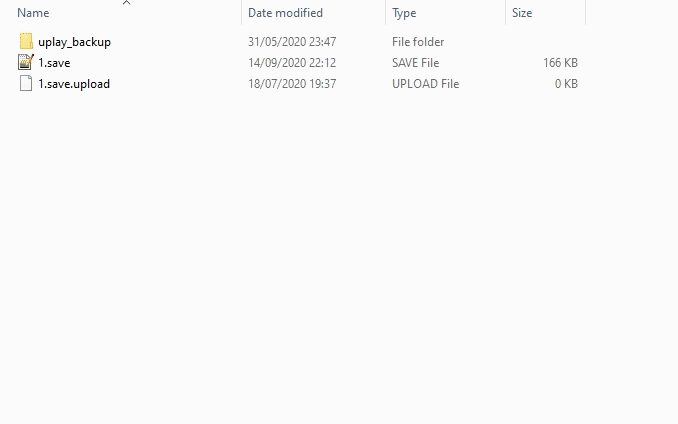
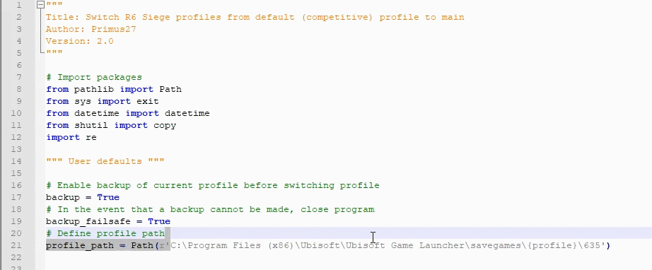
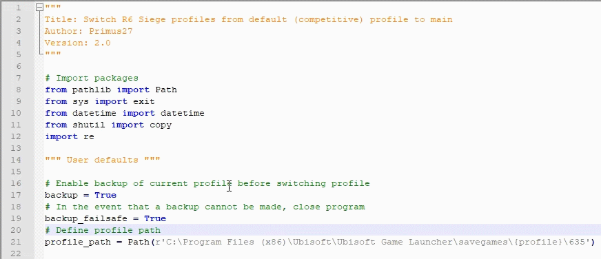

## Features
 - Easily switch from your main profile (containing all skins and attachments) to your competitive profile (containing legal skins) and vice versa.
 - Automatically create backups of profile w/ timestamps

## Screenshots

> Application demo

## Requirements and Installation
 1) Download and install [Python 3](https://www.python.org/)
 2) Navigate to your R6 profile directory:
    - C:\Program Files (x86)\Ubisoft\Ubisoft Game Launcher\savegames\\{profile}\635
 3) Copy this path to `switch.py` at ~line 21
    - This also can be found under `# Define profile path` ~line 20
    
    
    
 4) If you do not want to make backups, set the backup flag to 'False' at ~line 17 
    - This also can be found under `# Enable backup of current profile before switching profile` ~line 16
    
    

## Multiple Siege Accounts

If you have multiple accounts and aren't sure about which account is the right one, open up: **"C:\Users\\{name}\Documents\My Games\Rainbow Six - Siege\\{any profile}\GameSettings.ini"** and change **AimDownSightsMouse** ~line 109 to any number. Load up the game and see whether that account's ADS was affected. Keep trying until you find the right account.

## Usage
 - Run 'switch.py' by double clicking on the file

## Changelog
#### Version 1.0 - Initial release
 - Internal (not available)
#### Version 2.0 - Github release
 - Easily switch from your main profile (containing all skins and attachments) to your competitive profile (containing legal skins).
 - Automatically create backups of profile w/ timestamps

