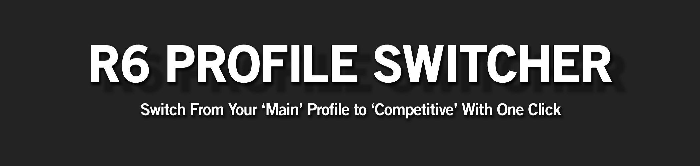
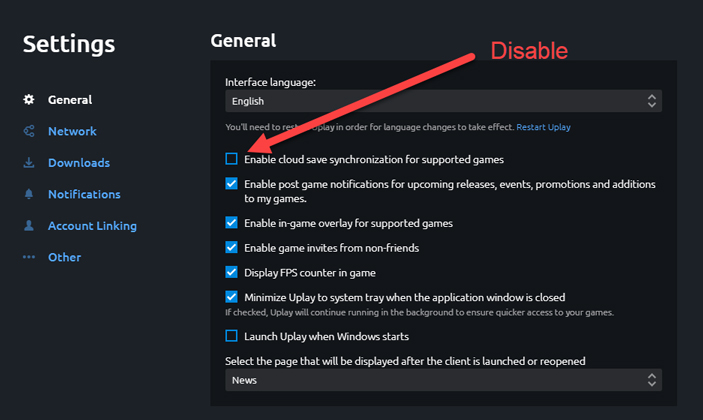
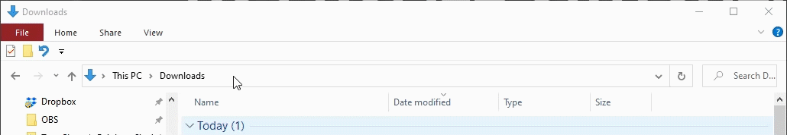

&nbsp;

No more swapping files whenever you want to scrim, the R6 Profile Switcher does everything for you. You can easily switch between your competitive profile (with default skins) and your skins that you use in ranked (i.e. Elites, Ember Rise skins...).

# Contents
* [Features](https://github.com/Primus27/R6-Profile-Switcher#features)
    * [Demo](https://github.com/Primus27/R6-Profile-Switcher#demo)
* [Usage](https://github.com/Primus27/R6-Profile-Switcher#usage)
    * [Arguments](https://github.com/Primus27/R6-Profile-Switcher#optional-arguments)
* [First time usage](https://github.com/Primus27/R6-Profile-Switcher#first-time-usage---important)
* [Optional - Build the app from source](https://github.com/Primus27/R6-Profile-Switcher#optional---build-the-app-from-source)
* [FAQ](https://github.com/Primus27/R6-Profile-Switcher#faq)
    * [Is this a cheat program?](https://github.com/Primus27/R6-Profile-Switcher#question-1)
* [Troubleshooting](https://github.com/Primus27/R6-Profile-Switcher#troubleshooting)
    * [Accounts not recognised](https://github.com/Primus27/R6-Profile-Switcher#issue-1)
* [Changelog](https://github.com/Primus27/R6-Profile-Switcher#changelog)
* [Element Attribution](https://github.com/Primus27/R6-Profile-Switcher#element-attribution)

&nbsp;

# Features
 - Portable app (no installation required)
 - Easily switch between profiles by navigating the intuitive menus.
 - Automatically retrieves account names on your PC so you don't have to do any work figuring out which account ID is the right one.
 - On the fly profile backup w/ timestamps
 - Backup failsafes to prevent anything from going wrong if a backup cannot be made
 - Full user feedback about what profile is active.
 - No coding knowledge required.

## Demo

&nbsp;

# Usage
 1) Download the latest version of profile switcher from [here](https://github.com/Primus27/R6-Profile-Switcher/releases).
 
 2) Disable cloud backup in Uplay: Uplay launcher -> settings -> general -> disable "Enable cloud save synchronisation for supported games". 
	- This is so that it doesn't keep restoring the profile stored in the cloud.
	
	
 3) Run EXE by double clicking on the file.
 
 4) Navigate through each step of the application (1-4). The step/stage colour denotes what you can or can't do. 
     - Red = Previous steps to be completed,
     - Yellow = Current step to complete,
     - Green = Completed (can still be used again)
     
 5) If this is the first time you're using the program, [do this afterwards]
 
&nbsp;
 
## Optional Arguments

- If you don't know what this means, don't worry; you don't _need_ to do this.

| Arg | Value? | Explanation |
| ------- | ------- | ------- |
| `-d` or `--debug`| No | Enables debug flag. This shows what websites/APIs have been used to acquire player information. |

&nbsp;

# First time usage - Important
 
 This program does not auto-equip default skins onto your account - it just switches between YOUR profiles. This has to be done manually.
 
 1) Use the program to switch to the **competitive** profile for the desired account.
 
 2) Launch Siege for the same account.
 
 3) Set all skins (uniform + headgear) to default.
 
 4) Done. You can now switch back to the 'main' profile if you want. Now you have your non-default skins on your main profile, and default skins on your comp profile.
 
&nbsp;

# Optional - importing your existing profiles

If you already have your 1.save profiles backed up and normally do this process manually, you can add them without having to redo the entire process of switching skins again.

 1) Find your profile that you use for scrims and competitions.

 2) Rename your competitive profile to "1.save.competitive.bak".

 3) Find your profile that you use for ranked, etc.

 4) Rename your main profile to "1.save" or leave it if it is already named that.
 
 5) Place both of these files into your profile directory (the folder where you normally put them in). I.e /savegames/{account_id}/{3-4 digit number}/

 6) The profile switcher will now see the active profile is "main" and should be able to easily switch between them.

&nbsp;

# Optional - Build the app from source

If you don't want to use the released EXE, you can build the application yourself.

 1) Download and install [Python 3](https://www.python.org/)
    1) Navigate to [Python 3](https://www.python.org/downloads/windows/) install page.
    2) Click on '_Latest Python 3 Release - Python 3.X.X_' near top of page.
    3) Scroll down to '_Files_' and download either:
        1) '_Windows x86-64 embedded zip file_' or
        2) '_Windows x86-64 executable installer_'
    4) Install Python 3.
        1) Make sure that:
            - '_Install launcher for all users_' = **checked**
            - '_Add Python 3.8 to PATH_' = **checked**
        2) Click on '_Disable path length limit_' (requires admin privileges).
 
 2) Download the [source code](https://github.com/Primus27/R6-Profile-Switcher/archive/master.zip).
 
 3) Install dependencies (found in requirements.txt)
    1) Press `Win`+`S`.
    
    2) Type `file explorer`.
    
    3) Using the file explorer, navigate to your (downloads?) directory where `requirements.txt` is.
    
    4) In the file explorer address bar type `cmd` and press `ENTER`.
    
    
    &nbsp;
    
    5) Using command prompt (cmd), type `pip3 install -r requirements.txt`. If that doesn't work, type `py -3 -m pip install -r requirements.txt`
 
 4) Using the command prompt, type `pyrcc5 resources.qrc -o resources.py`
 
 5) Using the command prompt, type `pyinstaller --onefile --windowed --name "R6 Profile Switcher" --icon="{current directory}\src\dist\r6-logo.ico" app.py`, where {current directory} is the extracted R6 Profile Switcher folder.
 
 6) Program located in 'dist' folder

&nbsp;

# FAQ

### Question 1
**Question:** Does this swap your skins by swapping out your save file? Because that's technically bannable isn't it? Or only if its for skins you don't have?

**Answer:** This program is not a cheat program and does not hook into the game. It swaps the save file (1.save) with one that belongs to you (and only you). <ins>This way it doesn't swap skins with anything you don't have</ins>. Bear in mind, "1.save" only handles skins and attachments and considering that this script uses "copies" of your profiles, it will never equip something that you have never equipped yourself.

&nbsp;

# Troubleshooting

### Issue 1

Program is not recognising my accounts.

**Solution:**

The program was set up in a way that users don't have to enter any information, including drive paths. So if it doesn't find the account, submit an issue on Github and provide some more information.

Initially, the program will look for your Uplay installation and check if the savegames folder exists (it should). If it doesn't, the application checks every drive for your accounts, following the format: `{drive}://Program Files (x86)/Ubisoft/Ubisoft Game Launcher/savegames`

&nbsp;

# Changelog

### BETA Version 4.2.0 - Added Active Profile Indicator and 'Getting Started' Menu
 - Program now tells you what profile is active for the selected account. This means you don't have to switch profiles just to see the active one.
 - Added a 'Getting started' window under 'View' for noobs.
 - Fixed the demo gif.

### BETA Version 4.1.2 - Improved account search for non-default Uplay installations
 - Program accesses registry to determine where the Uplay Launcher is installed (this should be where the profiles are).

### BETA Version 4.1.1 - Improved account search compatibility
 - Some people had their 1.save under a different directory. This update improves compatibility for those with different Siege App IDs.

### BETA Version 4.1.0 - Added Dark Theme and Light Theme
 - Default is set to 'dark'. You can use the light theme under the 'View' tab.
 - App no longer looks like it's from the Windows XP era.
 
### BETA Version 4.0.3 - Added ico file
 - Removed /src/dist/ from exclusions, allowing those who build from source to add the icon.

### BETA Version 4.0.2 - Updated program version
 - Updated application to display the correct version.
 
### BETA Version 4.0.1 - Hotfix
 - Fixed: Application crashes if 'find account' button spammed as a result of too many threads being opened.
    - Limit 'step 1' action to once every 10 seconds (you shouldn't need to do this more than once per launch).
    - Add default timeout of 5 seconds for http requests.
    - Added max of 10 workers for threading.

### BETA Version 4.0.0 - Program rework (GUI)
 - Application reworked for use with a GUI.
    - It's still somewhat experimental and may have a few bugs.
    
### Version 3.8.2 - Menu Input Fix
 - Players were still unable to enter single digits on profile selection - this has now been fixed.
 
### Version 3.8.1 - Updated program version
 - Updated application to display the correct version.
 
### Version 3.8.0 - Added arguments
 - Program automatically hides player information retrieval
 - Player can temporarily enable information (i.e. debug info) via command-line arguments.
    - E.g. `> python3 switch_v3.py --debug`
    
### Version 3.7.2 - Updated README.md & demo files
 - Updated README.md to reflect new program changes and layout.
 
### Version 3.7.1 - Updated README.md
 - Updated README.md
 
### Version 3.7.0 - Check for updates
 - Automatically check whether program version is latest version.
 - Added License to repository.
 
### Version 3.6.0 - Threading support
 - Retrieving account names is now done through threading.
    - This leads to a significant performance increase for those with >1 account. 
 
### Version 3.5.1 - Updated program version
 - Updated application to display the correct version.
 
### Version 3.5.0 - User Agent
 - Requests now use popular user agents to prevent them from getting rejected.
    - If name cannot be established, another UA is used to try again.
 
### Version 3.4.1 - Menu Input Fix
 - Selecting menu items no longer requires '0' prefix for single digits.
    - I.e. Menu item '01' can be entered as '01' or '1'.
 
### Version 3.4.0 - Requests replace webscraping
 - Account name retrieval no longer uses webscraping but rather requests.
    - Program is now significantly faster to retrieve account names.
 - Code refactored.
 - Updated README.md
 
### Version 3.3.1 - Bugfix
 - Suppressed logging message from "DevTools" when webscraping.
 
### Version 3.3.0 - Webscraping
 - Webscrape R6 sites for username resolving.
    - Note: This method takes longer than interacting with the API and will only be used if the API is unreachable.
 - Multiple failsafes in place (API -> Site 1 -> Site 2 -> ...)
 - Added additional feedback to user if webscraping is performed.
 
### Version 3.2.1 - Updated README.md
 - Updated README.md 
 
### Version 3.2.0 - Steam & multi-drive support
 - Updated README.md w/ contents page, etc.
 - Now supports profiles when uplay is stored on <u>other</u> drives (A-Z).
 - Now supports profiles when Siege is launched through Steam.
 
### Version 3.1.1 - API error feedback
 - Correct handling of R6Tabs API error, even when they return a code 200 with missing information.
 - User now informed if profiles could not be resolved.
 
### Version 3.1.0 - Siege process checker
 - Added an event to check whether R6 Siege (process) is running during script execution. Script will exit if Siege is running to prevent any issues with profiles not switching correctly.      

### Version 3.0.2 - Updated troubleshooting / FAQ
 - Updated troubleshooting FAQ for those having issues.

### Version 3.0.1 - Troubleshooting FAQ
 - Added troubleshooting FAQ for those having issues.

### Version 3.0.0 - Program rework (menus, player name resolver...)
 - Added menu.
 - Added on the fly backup enable / disable.
 - Added player ID to player name resolver - no more copy/pasting paths.
 - Added 'active profile' feedback before profile selection.

### Version 2.0.0 - Github release
 - Easily switch from your main profile (containing all skins and attachments) to your competitive profile (containing legal skins).
 - Automatically create backups of profile w/ timestamps.

### Version 1.0.0 - Initial release
 - Internal (not available).

&nbsp;
    
# Element Attribution

#### Database icon
  - Icons made by [Freepik](https://www.freepik.com) from [Flaticon](https://www.flaticon.com/)

#### Ubisoft icon
  - Icons made by [Freepik](https://www.freepik.com) from [Flaticon](https://www.flaticon.com/)

#### User icon
  - Icons made by [Freepik](https://www.freepik.com) from [Flaticon](https://www.flaticon.com/)

#### Switch icon
  - Icons made by [Pixel Perfect](https://www.flaticon.com/authors/pixel-perfect) from [Flaticon](https://www.flaticon.com/)

#### R6 Logo
  - Rainbow Six Siege icon by [Icons8](https://icons8.com)

#### Application style

##### Dark Mode
 - [Aqua style sheet](https://github.com/GTRONICK/QSS) by [Qtronick](https://github.com/GTRONICK)

##### Light Mode
 - [Combinear](https://qss-stock.devsecstudio.com/templates.php)
