&nbsp;

No more swapping files whenever you want to scrim, the R6 Profile Switcher does everything for you. You can easily switch between your competitive profile (with default skins) and your skins that you use in ranked (i.e. Elites, Ember Rise skins...).

# Contents
* [Features](https://github.com/Primus27/R6-Profile-Switcher#features)
    * [Demo](https://github.com/Primus27/R6-Profile-Switcher#demo)
    * [Screenshots](https://github.com/Primus27/R6-Profile-Switcher#screenshots)
* [Requirements and Installation](https://github.com/Primus27/R6-Profile-Switcher#requirements-and-installation)
* [Usage](https://github.com/Primus27/R6-Profile-Switcher#usage)
    * [Arguments](https://github.com/Primus27/R6-Profile-Switcher#arguments)
* [FAQ](https://github.com/Primus27/R6-Profile-Switcher#faq)
    * [Is this a cheat program?](https://github.com/Primus27/R6-Profile-Switcher#question-1)
* [Troubleshooting](https://github.com/Primus27/R6-Profile-Switcher#troubleshooting)
    * [Program not launching](https://github.com/Primus27/R6-Profile-Switcher#issue-1)
    * [Program crashes immediately](https://github.com/Primus27/R6-Profile-Switcher#issue-2)
    * [Program hangs at launch](https://github.com/Primus27/R6-Profile-Switcher#issue-3)
    * [Accounts not recognised](https://github.com/Primus27/R6-Profile-Switcher#issue-4)
* [Changelog](https://github.com/Primus27/R6-Profile-Switcher#changelog)
* [Legacy v2](https://github.com/Primus27/R6-Profile-Switcher#legacy-v2)   
    * [Screenshots](https://github.com/Primus27/R6-Profile-Switcher#screenshots-1)
    * [Requirements and Installation](https://github.com/Primus27/R6-Profile-Switcher#requirements-and-installation-1)
    * [Getting your Siege ID](https://github.com/Primus27/R6-Profile-Switcher#multiple-siege-accounts)

&nbsp;

# Features
 - Easily switch between profiles by navigating the intuitive menus.
 - Automatically retrieves account names on your PC so you don't have to do any work figuring out which account ID is the right one.
 - On the fly profile backup w/ timestamps
 - Backup failsafes to prevent anything from going wrong if a backup cannot be made
 - Full user feedback about what profile is active.
 - No coding knowledge required.

## Demo

> Demo

## Screenshots

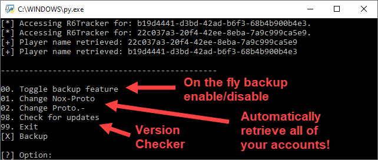
> Main menu

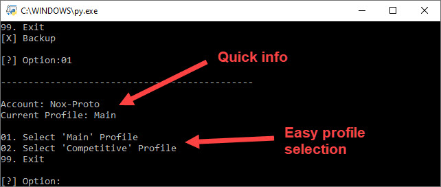
> Profile selection

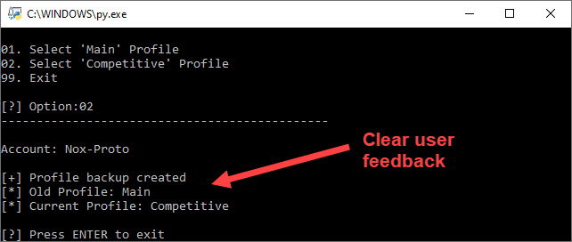
> Summary info

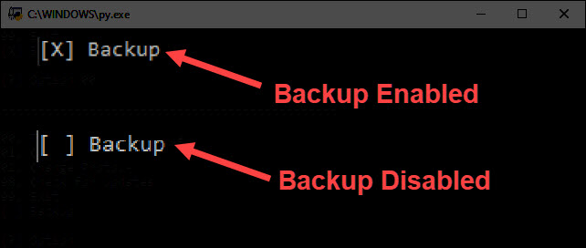
> Backup indicator

> Update check (latest version)

> Update check (old version)

&nbsp;

# Requirements and Installation
 1) Download and install [Python 3](https://www.python.org/)
    1) Navigate to [Python 3](https://www.python.org/downloads/windows/) install page
    2) Click on '_Latest Python 3 Release - Python 3.X.X_' near top of page
    3) Scroll down to '_Files_' and download either:
        1) '_Windows x86-64 embedded zip file_' or
        2) '_Windows x86-64 executable installer_'
        
        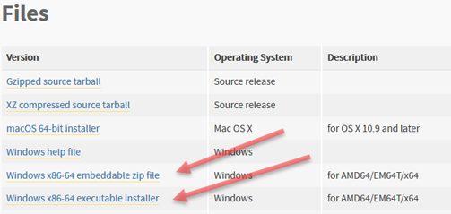
    4) Install Python 3
        1) Make sure that:
            - '_Install launcher for all users_' = **checked**
            - '_Add Python 3.8 to PATH_' = **checked**
            
            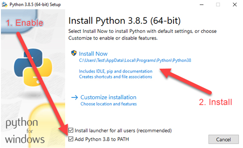
        2) Click on '_Disable path length limit_' (requires admin privileges)
        
            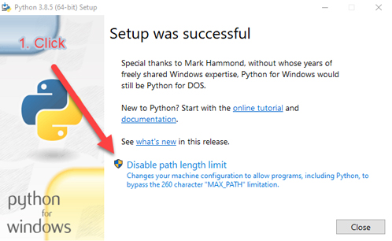
 
 2) Download R6 Profile Switcher program & dependencies
    1) Head to the [repository releases tab](https://github.com/Primus27/R6-Profile-Switcher/releases)
    
    2) Download the latest `R6_Profile_Switcher_v3.X.X.py` and `requirements.txt` files by clicking on each one and saving them.
 
 3) Install dependencies (found in requirements.txt)
    1) Press `Win`+`S`
    
    2) Type `file explorer`
    
    3) Using the file exporer, navigate to your (downloads) directory where `requirements.txt` is
    
    4) In the file exporer address bar type `cmd` and press `ENTER`
    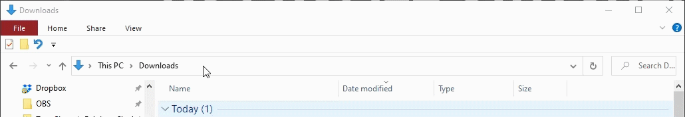
    
    &nbsp;
    
    5) Using command prompt (cmd) type `pip3 install -r requirements.txt`. If that doesn't work, type `py -3 -m pip install -r requirements.txt`
    
    
 4) Disable cloud backup in Uplay: Uplay launcher -> settings -> general -> disable "Enable cloud save synchronisation for supported games". 
	- This is so that it doesn't keep restoring the profile stored in the cloud.
	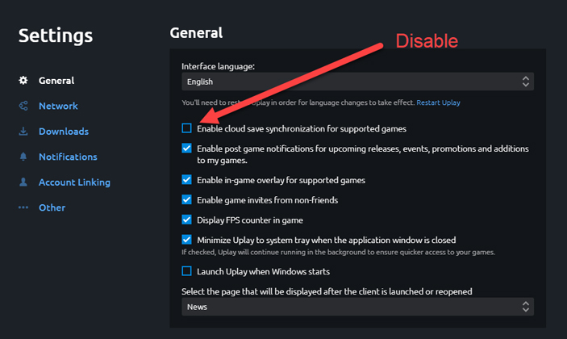

# Usage
 - Run 'switch_v3.py' by double clicking on the file
 
## Arguments

| Arg | Value? | Explanation | Required? |
| ------- | ------- | ------- | ------- |
| `-d` or `--debug`| No | Enables debug flag. This shows what websites/APIs have been used to acquire player information. | No |

# FAQ

### Question 1
**Question:** Does this swap your skins by swapping out your save file? Because that's technically bannable isn't it? Or only if its for skins you don't have?

**Answer:** This program is not a cheat program and does not hook into the game. It swaps the save file (1.save) with one that belongs to you (and only you). <ins>This way it doesn't swap skins with anything you don't have</ins>. Bear in mind, "1.save" only handles skins and attachments and considering that this script uses "copies" of your profiles, it will never equip something that you have never equipped yourself.

# Troubleshooting

### Issue 1
**Issue:** Double clicking on the program opens a text editor or other program.

**Solution:** File associations are set up wrong. Right click on the python file and select `open with`. Choose `python` from the list or click `more apps 🠫` and select `python`.

&nbsp;

### Issue 2
**Issue:** Program does not launch / immediately crashes.

**Solution:** This happens because Python was not added to your (environment variables) PATH (See installation). You can verify this by opening command prompt where the program is located and typing `python switch_v3.py`. Receiving an error such as `this system cannot run the specified program` or `'python' is not recognized as an internal or external command` means that you need to add python to your PATH. [This video shows you how to do it.](https://www.youtube.com/watch?v=Y2q_b4ugPWk)

&nbsp;

### Issue 3
**Issue:** Program launches and displays title (program name and developer...) but does not load menu options immediately.

**Solution:** This happens because an API call is made to R6tabs to check what accounts are on your system. Unfortunately, there is nothing you can do here as it typically takes 1-2 seconds to receive a response.

&nbsp;

### Issue 4
**Issue:** Program is not recognising my accounts.

**Solution:** The program was set up in a way that users don't have to enter any information, including drive paths. 
Whilst recent program versions check every drive for your accounts, it is still expected that they follow the format: `{drive}://Program Files (x86)/Ubisoft/Ubisoft Game Launcher/savegames`

# Changelog
### Version 1.0.0 - Initial release
 - Internal (not available)
 
### Version 2.0.0 - Github release
 - Easily switch from your main profile (containing all skins and attachments) to your competitive profile (containing legal skins).
 - Automatically create backups of profile w/ timestamps
 
### Version 3.0.0 - Program rework (menus, player name resolver...)
 - Added menu
 - Added on the fly backup enable / disable
 - Added player ID to player name resolver - no more copy/pasting paths
 - Added 'active profile' feedback before profile selection
 
### Version 3.0.1 - Troubleshooting FAQ
 - Added troubleshooting FAQ for those having issues
 
### Version 3.0.2 - Updated troubleshooting / FAQ
 - Updated troubleshooting FAQ for those having issues
 
### Version 3.1.0 - Siege process checker
 - Added an event to check whether R6 Siege (process) is running during script execution. Script will exit if Siege is running to prevent any issues with profiles not switching correctly.

### Version 3.1.1 - API error feedback
 - Correct handling of R6Tabs API error, even when they return a code 200 with missing information
 - User now informed if profiles could not be resolved
 
### Version 3.2.0 - Steam & multi-drive support
 - Updated README.md w/ contents page, etc.
 - Now supports profiles when uplay is stored on <u>other</u> drives (A-Z)
 - Now supports profiles when Siege is launched through Steam
 
### Version 3.2.1 - Updated README.md
 - Updated README.md
 
### Version 3.3.0 - Webscraping
 - Webscrape R6 sites for username resolving.
    - Note: This method takes longer than interacting with the API and will only be used if the API is unreachable.
 - Multiple failsafes in place (API -> Site 1 -> Site 2 -> ...)
 - Added additional feedback to user if webscraping is performed
 
### Version 3.3.1 - Bugfix
 - Suppressed logging message from "DevTools" when webscraping
 
### Version 3.4.0 - Requests replace webscraping
 - Account name retrieval no longer uses webscraping but rather requests
    - Program is now significantly faster to retrieve account names
 - Code refactored
 - Updated README.md

### Version 3.4.1 - Menu Input Fix
 - Selecting menu items no longer requires '0' prefix for single digits
    - I.e. Menu item '01' can be entered as '01' or '1'

### Version 3.5.0 - User Agent
 - Requests now use popular user agents to prevent them from getting rejected
    - If name cannot be established, another UA is used to try again
    
### Version 3.5.1 - Updated program version
 - Updated application to display the correct version

### Version 3.6.0 - Threading support
 - Retrieving account names is now done through threading.
    - This leads to a significant performance increase for those with >1 account.
    
### Version 3.7.0 - Check for updates
 - Automatically check whether program version is latest version
 - Added License to repository

### Version 3.7.1 - Updated README.md
 - Updated README.md

### Version 3.7.2 - Updated README.md & demo files
 - Updated README.md to reflect new program changes and layout

### Version 3.8.0 - Added arguments
 - Program automatically hides player information retrieval
 - Player can temporarily enable information (i.e. debug info) via command-line arguments
    - E.g. `> python3 switch_v3.py --debug`

&nbsp;

# Legacy (v2)

NOTE: switch_v2.py is legacy software and should only be used if you encounter issues with v3.
The newer version is however backwards compatible with the old version and vice versa.
This means your profiles will still work regardless of which version are using.

### Screenshots

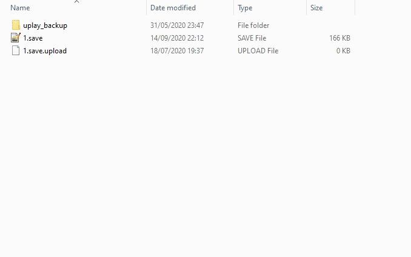
> Application demo

### Requirements and Installation
 1) Download and install [Python 3](https://www.python.org/)
 2) Download `switch_v2.py` (Download the repository as zip and extract)
 3) Disable cloud backup in Uplay: Uplay launcher -> settings -> disable "Enable cloud save synchronisation for supported games". 
	- This is so that it doesn't keep restoring the profile stored in the cloud.
 4) Navigate to your R6 profile directory:
    - C:\Program Files (x86)\Ubisoft\Ubisoft Game Launcher\savegames\\{profile}\635
 5) Copy this path to `switch.py` at ~line 21
    - This also can be found under `# Define profile path` ~line 20
    - You can do do this by right clicking on the `.py` file and selecting `open with notepad` or `open with notepad++`
    
    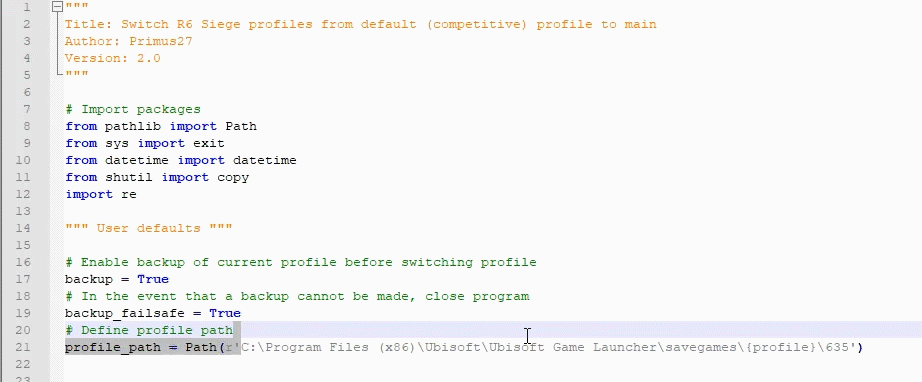
    
 6) If you do not want to make backups, set the backup flag to 'False' at ~line 17 
    - This also can be found under `# Enable backup of current profile before switching profile` ~line 16
    - You can do do this by right clicking on the `.py` file and selecting `open with notepad` or `open with notepad++`
    
    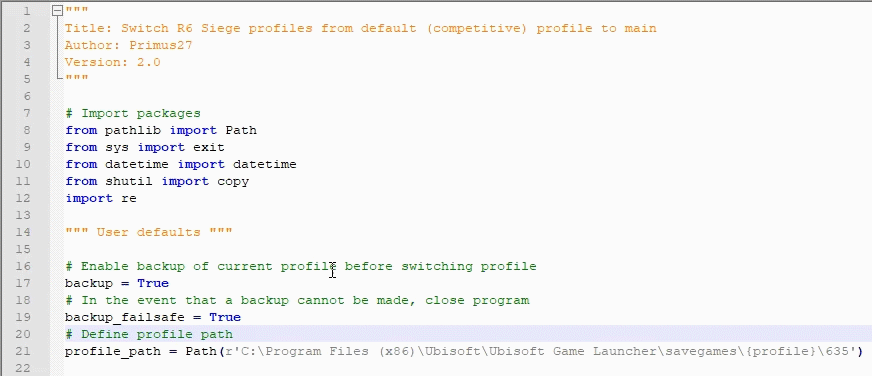

### Multiple Siege Accounts

#### Method 1
If you have multiple accounts and aren't sure about which account is the right one, open up: **"C:\Users\\{name}\Documents\My Games\Rainbow Six - Siege\\{any profile}\GameSettings.ini"** and change **AimDownSightsMouse** ~line 109 to any number. Load up the game and see whether that account's ADS was affected. Keep trying until you find the right account.

#### Method 2
Visit [R6Tab](https://tabstats.com/siege) and enter your playername.
Afterwards, check the URL and your account ID will be seen at this part of the URL:
https://tabstats.com/siege/player/{name}/{**account_ID**}

